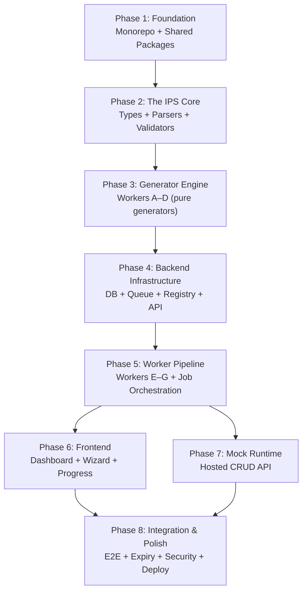

# InstantMockAPI — Development Phase Plan

> Ordered by the dependency graph: **foundation → engine → backend → frontend → integration → polish → launch.**
> Each phase delivers a testable, demonstrable milestone. No phase starts work that depends on an unfinished predecessor.

---

## Phase Overview



---

## Phase 1 — Foundation (Monorepo + Shared Packages)

**Goal:** A compilable, lintable monorepo with tooling and shared utilities. No business logic yet — just the skeleton everything plugs into.

### Tasks

- [ ] Initialize monorepo: `pnpm workspaces` + `Turborepo`
- [ ] Set up `tooling/` — shared ESLint config, Prettier config, `tsconfig` base (strict mode)
- [ ] Set up `dependency-cruiser` rules enforcing the import graph from [doc 05 §4](file:///d:/InstantMockAPI/plan/05-monorepo-architecture.md)
- [ ] Create `packages/shared` — Logger, structured error types (`AppError` with code + message + details), Result type (`Result<T, E>`)
- [ ] Create `packages/config` — env loading, plan limits (Free/Pro/Enterprise: 2/7/30 days, 1/3/∞ jobs), all in one place
- [ ] Create empty `apps/` shells (api, web, workers, mock-runtime) with package.json stubs
- [ ] Create empty `packages/` shells (ips, parsers, generators/*, queue, registry, db, auth, ui)
- [ ] Set up CI pipeline: `lint → typecheck → test → build` (affected-only via Turborepo)
- [ ] Conventional Commits hook (commitlint)

### Deliverable
A monorepo where `pnpm install && pnpm turbo build` succeeds, `dependency-cruiser` passes, and every package compiles (even if empty).

### Verify
```bash
pnpm turbo build        # all packages compile
pnpm turbo lint         # all packages pass
pnpm turbo typecheck    # strict mode, no errors
```

---

## Phase 2 — The IPS Core (Types + Parsers + Validation)

**Goal:** The Internal Project Schema is fully defined, validatable, and producible from JSON input. This is **the most important phase** — every downstream package depends on the IPS types.

### Tasks

#### `packages/ips` (the foundation of everything)
- [ ] Define the full IPS TypeScript types: `Entity`, `Field`, `FieldType`, `ValidationRules`, `GenerationConfig`, `InternalProjectSchema`
- [ ] Field types: `string | number | decimal | integer | boolean | date | email | url | uuid | enum | object | array`
- [ ] Validation model: Layer 1 (auto-detected) + Layer 2 (custom) merged into one `validation` object per field
- [ ] `children[]` recursion for nested objects/arrays
- [ ] IPS meta-schema validator (validate an IPS is structurally correct)
- [ ] Nesting depth cap enforcement (default 10) with path-pointed errors
- [ ] IPS versioning utilities (snapshot, bump, compare)
- [ ] Export all types — these become the contract consumed by every parser and generator

#### `packages/parsers` — `json-adapter` (first parser)
- [ ] Walk a JSON payload → infer entities, field types, nested structures
- [ ] ISO string detection → `date` type
- [ ] Key-name heuristics → format suggestions (`email`, `phone`, `url`) as Layer 1 hints
- [ ] Output: valid IPS or structured parse error with offending path (`addresses[0].location.city`)
- [ ] Handle arrays of objects, nested objects, arrays inside objects

#### `packages/parsers` — `builder-adapter`
- [ ] Thin adapter (largely identity) — ensures builder output conforms to IPS types

#### Tests
- [ ] IPS validation: valid schemas pass, invalid schemas rejected with correct error paths
- [ ] Depth cap: fixture at depth 11 → rejected
- [ ] JSON parser fixture suite: flat entity, nested objects, arrays of objects, the 4-level demo schema (`primaryDetail → addresses[] → location → education[] → college → address`)
- [ ] Format detection: fields named `email`, `phone`, `url` get correct Layer 1 hints

### Deliverable
```
JSON payload → json-adapter → valid IPS (or structured error)
```
Runnable as a pure function in a test. No DB, no API, no UI needed.

### Verify
```bash
pnpm turbo test --filter=packages/ips
pnpm turbo test --filter=packages/parsers
```

---

## Phase 3 — Generator Engine (Workers A–D)

**Goal:** Given an IPS + generationConfig, produce real generated artifacts as strings/files. All generators are **pure functions** — no I/O, no DB, no network.

### Tasks

#### `packages/generators/validation` (Worker B — Zod + Yup) ← Start here, most tangible
- [ ] Zod generator: IPS → complete `.ts` file with `z.object`, `z.array(z.object(...))` for nesting
- [ ] All validation rules: required, nullable, optional, default, min, max, length, regex, enum, email, url, uuid, date, number, decimal, integer, array length, unique (as comment), custom messages
- [ ] Yup generator: same IPS → Yup equivalent
- [ ] Named nested schemas for readability (`customerAddressLocationSchema`)

#### `packages/generators/schema` (Worker A — JSON Schema)
- [ ] IPS → JSON Schema with nested `properties`/`items`
- [ ] Validation rules mapped to JSON Schema keywords

#### `packages/generators/types` (Worker C — TypeScript)
- [ ] IPS → TypeScript interfaces + DTOs
- [ ] Named sub-interfaces for nested structures (`CustomerAddressLocation`)
- [ ] `required` → optionality, `enum` → union types, `date` → `string` (ISO) with comment

#### `packages/generators/mock-data` (Worker D — Faker)
- [ ] IPS → faker-style records honoring type + constraints
- [ ] Respect min/max/length/regex/enum; valid emails for email fields, etc.
- [ ] Configurable record count (default 25)
- [ ] Deterministic output with seed (for testing)
- [ ] Output: seed data JSON + example responses (consumed by Workers E and F)

#### Tests — Golden-file tests for each generator
- [ ] Canonical IPS fixtures (shared from `packages/ips`): flat entity, nested, 4-level demo
- [ ] For each fixture: `generator(ips, config) → assert output matches golden file`
- [ ] Worker D: fixed seed → deterministic output

### Deliverable
```
IPS + config → Zod code, Yup code, JSON Schema, TypeScript interfaces, 25 mock records
```
All runnable as pure functions in tests. Still no server needed.

### Verify
```bash
pnpm turbo test --filter="packages/generators/*"
# Golden file tests pass; generated Zod/Yup files are valid (can be compiled)
```

---

## Phase 4 — Backend Infrastructure (DB + Queue + Registry + API)

**Goal:** The persistence layer, job queue, artifact registry, and core REST API. After this phase, you can create a project, trigger generation, and track artifact status — all via API calls.

### Tasks

#### `packages/db` — MongoDB models + indexes
- [ ] Models: `users`, `projects`, `versions`, `artifacts`, `jobs`, `mockStores`, `apiLogs`
- [ ] All indexes from [doc 07 §3](file:///d:/InstantMockAPI/plan/07-database-design.md)
- [ ] Expiry cleanup queries (`{ status: "active", "hosted.expiresAt": ≤ now }`)
- [ ] Connection management, environment-based config

#### `packages/registry` — Artifact Registry
- [ ] Status machine: `pending → generating → completed | failed`
- [ ] Artifact record CRUD: create, update status, query by project
- [ ] Version stamping on each generation
- [ ] Exhaustive transition tests (illegal transitions rejected)

#### `packages/queue` — BullMQ job abstractions
- [ ] Job creation with idempotency key (`hash(projectId, ipsVersion, config)`)
- [ ] Worker task types and payload schemas
- [ ] Retry policy (exponential backoff, 3 automatic attempts)
- [ ] Concurrency enforcement (plan-based: 1/3/∞)

#### `packages/auth` — AuthN/AuthZ
- [ ] JWT token issuance, verification, refresh
- [ ] Middleware for Fastify (shared by `apps/api` and `apps/mock-runtime`)
- [ ] Ownership check helper (`project.ownerId === token.sub`)

#### `apps/api` — Core REST API (Fastify)
- [ ] Auth routes: `POST /v1/auth/login`, `/refresh`, `/logout`, `GET /v1/me`
- [ ] Project routes: CRUD (`GET/POST/PATCH/DELETE /v1/projects/*`), `POST /parse`
- [ ] Generation routes: `POST /generate`, `POST /regenerate`, `POST /generate-again`
- [ ] Job routes: `GET /jobs/{id}`, `GET /jobs/{id}/stream` (SSE), `POST /retry`
- [ ] Artifact routes: `GET /artifacts`, `GET /artifacts/{type}`, `GET /download`, `GET /export`
- [ ] Version routes: `GET /versions`, `POST /versions/{v}/restore`
- [ ] Pagination, filtering, sorting, search (`?page&limit&status&sort&q`)
- [ ] Uniform error responses (code + message + details)
- [ ] Rate limiting (per-user token bucket)
- [ ] Request validation via Fastify schema

#### Tests
- [ ] Registry state machine: exhaustive transition tests
- [ ] API contract tests: auth, ownership, status codes, error shape, pagination
- [ ] Idempotency: duplicate job creation → same job returned
- [ ] Concurrency: Free plan → 2nd job queued, not rejected

### Deliverable
A working API you can call with `curl` or Postman:
```bash
# Create project from JSON → get IPS back
curl -X POST /v1/projects -d '{"name":"CRM","inputSource":{"type":"json","raw":{...}}}'

# Trigger generation → get jobId
curl -X POST /v1/projects/{id}/generate -d '{"generationConfig":{...}}'

# Check job status
curl GET /v1/jobs/{jobId}
```

### Verify
```bash
pnpm turbo test --filter=packages/db
pnpm turbo test --filter=packages/registry
pnpm turbo test --filter=packages/queue
pnpm turbo test --filter=apps/api
```

---

## Phase 5 — Worker Pipeline (Workers E–G + Job Orchestration)

**Goal:** Jobs are consumed from the queue, generators are invoked, artifacts are written to storage + registry, progress is streamed via SSE. The full generate loop works end-to-end (API → queue → workers → registry → SSE).

### Tasks

#### `packages/generators/docs` (Worker E — OpenAPI + Postman)
- [ ] IPS + config → OpenAPI 3.0 spec (only selected methods documented)
- [ ] Example bodies from Worker D's example responses
- [ ] Postman collection generator

#### `packages/generators/hosting` (Worker F — mock-runtime config)
- [ ] Produces routing config (entities, methods, validation rules, seed store reference)
- [ ] Consumes Worker D's seed data as initial `mockStores` content

#### `packages/generators/export` (Worker G — ZIP bundle)
- [ ] Bundle all produced artifacts + README noting IPS version
- [ ] Single-artifact download support

#### Object Storage integration
- [ ] S3-compatible client (upload/download/delete artifacts)
- [ ] `storageRef` management on artifact records

#### `apps/workers` — Job orchestration
- [ ] BullMQ consumer: pick up job → expand into per-worker tasks per `generationConfig`
- [ ] DAG scheduler: Level 0 (A/B/C/D parallel) → Level 1 (E/F after D) → Level 2 (G after all)
- [ ] Each task: invoke generator → write to object storage → update registry status
- [ ] Selective generation: only enqueue workers matching config
- [ ] Retry handling: auto-retry with backoff (3 attempts) → manual retry re-enqueues single worker
- [ ] Progress reporting: each status transition written to registry → API picks up for SSE

#### SSE progress streaming
- [ ] `apps/api` subscribes to registry changes → pushes SSE to `GET /jobs/{id}/stream`
- [ ] Progress aggregator: settled / total selected = overall %

#### Tests
- [ ] Worker E/F golden-file tests
- [ ] DAG ordering: E/F don't start until D completes; G bundles only produced artifacts
- [ ] Retry: transient failure → auto-retry → after exhaustion → `failed` with `errorMessage`
- [ ] Selective: config with only Zod → only Workers B, D, E(?), G run
- [ ] Full pipeline integration test: create project → generate → all artifacts in registry as `completed`

### Deliverable
The full backend loop works:
```
POST /generate → job created → workers run in parallel → artifacts appear in registry
                                                        → SSE stream shows live progress
                                                        → generated files downloadable
```

### Verify
```bash
pnpm turbo test --filter=apps/workers
pnpm turbo test --filter="packages/generators/*"
# Integration test: end-to-end generation via API
```

---

## Phase 6 — Frontend (Dashboard + Wizard + Progress + Project Page)

**Goal:** The complete web UI. A user can sign in, create a project, build a schema, configure generation, review, watch progress, and use the results.

> **Phase 6 and Phase 7 can run in parallel** — they have no dependency on each other, only on Phase 5.

### Tasks

#### `packages/ui` — Design System + Shared Components
- [ ] CSS custom properties: all tokens from [doc 12](file:///d:/InstantMockAPI/plan/12-design-system.md) (colors, typography, spacing, radius)
- [ ] Dark theme (default) + light theme
- [ ] `Button` (primary/secondary/ghost/danger)
- [ ] `StatusChip` (pending/generating/completed/failed/active/expired) — generating pulses cyan
- [ ] `Card` (surface + hairline border)
- [ ] `Input`, `Select`, `Toggle`
- [ ] `CodeBlock` (mono, syntax-highlighted, copy button)
- [ ] `Modal`, `Drawer`, `Toast`
- [ ] `CountdownBadge` (tabular-nums, amber warning near expiry)
- [ ] `ProgressBar`, `WorkerRow`
- [ ] `SchemaTree` (collapsible entity→field→nested tree)
- [ ] `ValidationPopover` (Layer 2 rule editor)

#### `apps/web` — Next.js App
- [ ] **Layout:** Sidebar nav (Dashboard, New Project, Templates, Settings, Billing) + top bar (plan indicator, usage, account)

##### S1 · Dashboard
- [ ] Project card grid: name, entity count, status chip, plan badge, countdown, last generated
- [ ] Per-status actions (Continue setup / View progress / Open / Generate Again)
- [ ] Empty state, loading skeletons, error with retry
- [ ] New Project CTA

##### S2 · Input (wizard step 1)
- [ ] Tabbed selector: Paste JSON | Manual Schema Builder | Swagger/OpenAPI
- [ ] **Paste JSON tab:** code editor + Parse button → calls json-adapter → shows result
- [ ] **Manual Schema Builder** (the hardest UI piece):
  - Entity list + per-entity field rows (name, type dropdown, required toggle, default)
  - `object`/`array` types expand into indented child groups with "Add Field"
  - Unlimited nesting (up to depth cap), "Add Another" for dynamic arrays
  - Per-field validation popover (Layer 2)
  - Layer 1 hint chips (auto-suggest email/phone/url validation)
- [ ] Swagger/OpenAPI: file drop zone (can be lighter in V1)
- [ ] "Next" → preserves data on "Back"

##### S3 · Configure (wizard step 2)
- [ ] Validation checkboxes (Zod, Yup, Advanced: JSON Schema)
- [ ] Types checkbox (TypeScript)
- [ ] Methods checkboxes (GET/POST/PUT/PATCH/DELETE) with helper text
- [ ] Mock records per entity (number input, default 25)

##### S4 · Review (wizard step 3)
- [ ] Split layout: IPS tree (left) + generation summary (right)
- [ ] Inline edits (rename field, toggle required, adjust rules)
- [ ] Generate button (disabled if IPS invalid, with reason)

##### S5 · Progress
- [ ] Vertical worker board with live status transitions (SSE-driven)
- [ ] Only config-selected workers shown
- [ ] Failed row: error message + Retry button
- [ ] Dependency waits ("Waiting on Mock Data")
- [ ] Overall progress bar
- [ ] Safe to leave (background generation + notification on completion)

##### S6 · Project Page
- [ ] Hosted API card: URL, copy, method chips, request playground
- [ ] Artifact grid: status, version, timestamp, View/Download/Regenerate
- [ ] Regenerate modal (per-asset checkboxes)
- [ ] Version history panel with Restore
- [ ] Download ZIP

##### S7 · Expired State
- [ ] Grayed hosted API card, expired artifact markers
- [ ] IPS + config still viewable
- [ ] Generate Again CTA + upgrade prompt

##### S8 · Settings & Billing
- [ ] Plan comparison table, theme toggle, profile

##### S9 · Templates (light)
- [ ] Gallery of starter IPS models (CRM, E-commerce, Blog)

#### Client data layer
- [ ] TanStack Query (or alt) for API data fetching/caching
- [ ] SSE connection for progress board
- [ ] Client-side countdown ticking from `expiresAt`

### Deliverable
Full clickable web app connected to the real API. A user can go from Dashboard → New Project → Builder → Configure → Review → Generate → Progress → Project Page → Download.

### Verify
- Manual walkthrough of the happy path
- Component tests for `packages/ui`
- E2E (Playwright): happy-path test covering the full wizard flow

---

## Phase 7 — Mock Runtime (Hosted CRUD API)

**Goal:** The temporary hosted mock API server — project-isolated CRUD endpoints at `/p/{projectId}/{entity}`.

> **Runs in parallel with Phase 6.**

### Tasks

#### `apps/mock-runtime` — Fastify server
- [ ] Dynamic route resolution: `GET/POST/PUT/PATCH/DELETE /p/{projectId}/{entity}[/{id}]`
- [ ] On request: resolve project → load hosted-API config + seed data (Redis-cached) → route
- [ ] Only user-selected methods routed; unselected → `405`
- [ ] **GET**: paginated list (`?page&limit`, max 100) from seed data / mock store
- [ ] **GET /:id**: single record lookup
- [ ] **POST**: create record, validate against generated rules → `422` with field errors on failure
- [ ] **PUT/PATCH**: replace/update record with validation
- [ ] **DELETE**: remove record
- [ ] Per-project tenant isolation (one project cannot access another's data)
- [ ] Per-project rate limiting
- [ ] Request logging → `apiLogs` collection
- [ ] Post-expiry: route returns `404` for expired projects

#### Redis caching
- [ ] Cache hosted-API config per project (routing, validation rules)
- [ ] Cache seed data for fast reads
- [ ] Invalidate on regeneration / expiry

#### Tests
- [ ] CRUD operations on generated endpoints
- [ ] Unselected method → `405`
- [ ] Invalid write → `422` with correct field errors
- [ ] Tenant isolation: project A cannot read project B's data
- [ ] Pagination bounds (max limit enforced)
- [ ] Payload size caps
- [ ] Post-expiry: hosted route returns not-found

### Deliverable
```bash
# A real HTTP API backed by generated mock data
curl https://api.InstantMockAPI.dev/p/{projectId}/customers
# → [{ "name": "Jane Doe", "email": "jane@example.com", ... }, ...]

curl -X POST /p/{projectId}/customers -d '{"name":"","email":"invalid"}'
# → 422 { "error": { "details": [{ "path": "name", "issue": "required" }, ...] } }
```

### Verify
```bash
pnpm turbo test --filter=apps/mock-runtime
# Integration: generate project → hosted API serves real data → validates writes
```

---

## Phase 8 — Integration, Polish & Launch Readiness

**Goal:** Wire everything together end-to-end, add the scheduled workers, harden security, run full E2E tests, deploy.

### Tasks

#### Expiry System
- [ ] **Cleanup worker** (BullMQ repeatable job): scan for expired projects → hard-delete hosted assets (storage files, `mockStores`, hosted config) → null `storageRef` → set status `expired`
- [ ] **Reminder worker** (BullMQ delayed job): send pre-expiry email/dashboard notification with "Download ZIP" nudge
- [ ] Verify: project shell (name, input, IPS, config, versions) survives expiry
- [ ] Verify: "Generate Again" creates a new job from kept shell → new hosted URL

#### Security Hardening
- [ ] Input validation on all API routes (Fastify schema validation)
- [ ] IPS depth cap enforced at API layer (not just `packages/ips`)
- [ ] Payload size caps on mock-runtime
- [ ] Rate limiting tuning (platform API per-user + hosted API per-project)
- [ ] AuthZ denial paths tested (cross-tenant → 403/404)
- [ ] HTTPS configuration
- [ ] Secrets management (env variables via `packages/config`, no hardcoded secrets)
- [ ] `storageRef` downloads authorized through API, not public URLs

#### End-to-End Tests (Playwright)
- [ ] **Happy path**: Dashboard → Input (Paste JSON) → Configure → Review → Generate → Progress → Project Page → Download ZIP
- [ ] **Happy path**: Dashboard → Input (Manual Builder) → same flow
- [ ] Login + session persistence
- [ ] CRUD on hosted playground (create/read/update/delete mock records)
- [ ] Artifact View modal (syntax-highlighted generated code)
- [ ] Regenerate modal (per-asset)
- [ ] Version history + Restore
- [ ] Expired project → Generate Again
- [ ] Failed worker → Retry → completion
- [ ] Search/filter on dashboard
- [ ] Responsive (mobile walkthrough)
- [ ] Loading states (skeletons appear and resolve)
- [ ] Error handling (API errors render specific messages)

#### Performance Validation
- [ ] Full generation of 5-entity project: < 3 minutes (critical-path bound)
- [ ] First artifact visible on progress board: within seconds
- [ ] Hosted API p50 latency: verify cache-served path
- [ ] Dashboard with 50+ projects: responsive

#### Deployment
- [ ] Dockerfiles for each app (`web`, `api`, `workers`, `mock-runtime`)
- [ ] Docker Compose for local development
- [ ] Managed MongoDB (Atlas or alt) setup
- [ ] Managed Redis setup
- [ ] S3-compatible bucket setup
- [ ] Environment configs: `local → staging → production`
- [ ] CI/CD pipeline: affected-only build → test → deploy
- [ ] Domain + SSL: `InstantMockAPI.dev` + `api.InstantMockAPI.dev`

#### Documentation
- [ ] API reference (auto-generated from Fastify schemas or manual)
- [ ] Getting started guide for users
- [ ] Contributing guide for developers
- [ ] Move plan docs to `docs/` directory in the monorepo

### Deliverable
**Production-ready V1.** A user can sign up, create a project from any V1 input, generate all selected artifacts in parallel, use a hosted mock API, download a ZIP bundle, see expiry countdowns, and generate again after expiry.

### Verify
```bash
pnpm turbo test              # all unit + integration tests
pnpm playwright test         # full E2E suite
# Manual: deploy to staging, walk through full flow, verify expiry + generate again
```

---

## Phase Summary Table

| Phase | Name | Depends On | Key Packages | Demo Milestone |
|-------|------|------------|--------------|----------------|
| **1** | Foundation | — | `shared`, `config`, `tooling/` | `pnpm turbo build` passes |
| **2** | IPS Core | Phase 1 | `ips`, `parsers` | JSON → valid IPS in a test |
| **3** | Generator Engine | Phase 2 | `generators/validation`, `schema`, `types`, `mock-data` | IPS → Zod + TS + Mock Data output |
| **4** | Backend Infra | Phase 3 | `db`, `registry`, `queue`, `auth`, `apps/api` | `curl POST /generate` works |
| **5** | Worker Pipeline | Phase 4 | `generators/docs`, `hosting`, `export`, `apps/workers` | Full generation loop via API + SSE |
| **6** | Frontend | Phase 5 | `ui`, `apps/web` | Clickable web app, full wizard flow |
| **7** | Mock Runtime | Phase 5 | `apps/mock-runtime` | `curl GET /p/{id}/customers` returns mock data |
| **8** | Integration & Launch | Phase 6 + 7 | Expiry, E2E, deploy | Production-ready V1 |

> [!IMPORTANT]
> **Phases 6 and 7 are parallelizable** — they depend on Phase 5 but not on each other. This is the main opportunity for concurrent work streams if you have bandwidth.

> [!TIP]
> **Phase 2 (IPS Core) is the most critical.** Every downstream phase imports the IPS types. Invest extra time getting the type definitions, validation rules, and nesting model right — changes here ripple everywhere.

---

## Estimated Effort Distribution

```
Phase 1: Foundation           ██░░░░░░░░░░░░░░░░░░  ~5%
Phase 2: IPS Core             ████░░░░░░░░░░░░░░░░  ~10%
Phase 3: Generator Engine     ██████░░░░░░░░░░░░░░  ~15%
Phase 4: Backend Infra        ██████░░░░░░░░░░░░░░  ~15%
Phase 5: Worker Pipeline      ████░░░░░░░░░░░░░░░░  ~10%
Phase 6: Frontend             ████████████░░░░░░░░  ~25%
Phase 7: Mock Runtime         ████░░░░░░░░░░░░░░░░  ~8%
Phase 8: Integration & Launch ██████░░░░░░░░░░░░░░  ~12%
```

> [!NOTE]
> The frontend (Phase 6) is the largest single phase because of the **Manual Schema Builder** — unlimited nesting with validation popovers, Layer 1 hint chips, and responsive behavior is the most complex UI in the entire app.
