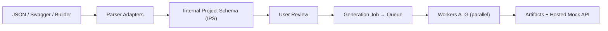

# InstantMockAPI — Full Project Review

I've read all 21 documents in your [plan/](file:///d:/InstantMockAPI/plan) directory. Here's my understanding and assessment.

---

## My Understanding of the Project

**InstantMockAPI is a backend-as-a-compiler SaaS platform.** A developer describes their data model once — via pasted JSON, a Swagger file, or a visual schema builder — and the system generates *every* backend artifact from a single intermediate representation (the Internal Project Schema / IPS), then optionally hosts a temporary CRUD mock API.



### The key mental model: "It's a compiler, not a database."

- **Front-ends** = input formats (JSON, Swagger, Manual Builder, future AI/Figma/OCR)
- **IR** = the IPS — one normalized model, versioned, the single source of truth
- **Back-ends** = generators (JSON Schema, Zod, Yup, TypeScript, Mock Data, OpenAPI, Postman, Hosted API, Export ZIP)

This framing is excellent — it makes the architecture clean and every design decision logically derivable.

---

## Assessment: What's Strong

### 1. Extremely Thorough Documentation
18 purpose-built documents + a master summary + a README index + a Claude prototyping prompt. Every concern from product vision to coding standards is covered. Cross-references between documents are consistent (e.g., "doc 09 §6" notation used everywhere).

### 2. The IPS as Single Source of Truth
This is the **architectural linchpin** and it's well-designed:
- Every parser writes to it, every generator reads from it — no exceptions
- Validation merges (Layer 1 auto + Layer 2 custom) happen *in the IPS before generation*, so generators never re-detect
- It's versioned (snapshots in `versions` collection), enabling restore and diffing
- The depth cap (default 10) is a good abuse-prevention measure

### 3. The Worker DAG is Sound
The dependency graph is correct:
```
Level 0 (parallel): A · B · C · D
Level 1 (after D):  E · F
Level 2 (after all): G
```
Workers E/F depending on D (for example responses and seed data) is a real data dependency, not an arbitrary sequencing. G bundling everything last makes sense.

### 4. Expiry Model is Well-Thought-Out
The "hard-delete hosted assets, keep the project shell" decision is smart:
- Bounds storage costs naturally
- Creates a clean upgrade pressure (Free 2d → Pro 7d → Enterprise 30d)
- The "Generate Again" one-click flow preserves UX after expiry
- The cleanup worker approach (vs. naive TTL) correctly handles the "shell survives" requirement

### 5. Failure Isolation
The rule "a project never fails as a whole — only individual workers fail" is both architecturally sound and user-friendly. Combined with the Artifact Registry tracking per-asset status, it enables per-worker retry without re-running successful siblings.

### 6. Selective Generation
The config-driven approach (only enqueue workers the user selected) avoids waste and keeps the 3-minute budget realistic.

### 7. Design System Identity
The "blueprint/schematic" identity — monospace for machine-derived output, quiet everywhere except the worker board — gives the product a distinctive feel rather than looking like a generic dashboard template.

---

## Observations, Gaps & Questions

### Architecture & Data Model

| # | Area | Observation | Severity |
|---|------|-------------|----------|
| 1 | **IPS field type list** | Doc 04 §F3 lists `email`, `url`, `uuid` as field *types*, but these are really `string` subtypes. Should the IPS distinguish between `type` and `format` (like JSON Schema does: `type: "string", format: "email"`)? Keeping them as top-level types simplifies the builder UI but makes generator logic do extra mapping. | ⚠️ Design |
| 2 | **Worker D always runs** | Doc 09 §5 says "Worker D still runs" even if no methods are selected (mock data is a core downloadable). But doc 10 §2 table says Worker D runs "always." This is consistent — just confirming: D is unconditional regardless of config? If so, E (docs) is also effectively unconditional since docs + examples are always useful. Clarify the exact "always run" vs "config-driven" boundary. | 💬 Clarify |
| 3 | **Partial regeneration DAG** | If a user regenerates only "Zod" (Worker B), do downstream workers re-run? B has no dependents in the DAG — so it's isolated. But if they regenerate "Mock Data" (Worker D), should E/F/G auto-cascade? Doc 04 §F13 says "selected workers only," but a stale docs artifact referencing old example data could cause drift. | ⚠️ Design |
| 4 | **mockStores mutation model** | The hosted API allows POST/PUT/PATCH/DELETE that *mutate* `mockStores`. On regeneration of Worker D, do these user-written records get replaced? If so, a frontend developer testing with custom records they POSTed would lose them. Worth documenting the "regeneration resets mock store" behavior explicitly. | ⚠️ Design |
| 5 | **IPS validation schema** | The IPS itself needs a validation schema (meta-schema) to enforce structural correctness before any job runs. Doc 13 §3 mentions this but it's not detailed anywhere. This schema should live in `packages/ips` and be the first thing tested. | 📋 Missing detail |
| 6 | **Builder ↔ IPS identity** | Doc 09 §2 says the builder-adapter is "largely identity" since the builder edits the IPS directly. This means the builder's React state *is* the IPS. Make sure the builder's state shape exactly mirrors the IPS TypeScript type — any divergence means a hidden adapter. | 💬 Clarify |

### Security & Operations

| # | Area | Observation | Severity |
|---|------|-------------|----------|
| 7 | **Hosted API auth** | Doc 13 §10 notes "custom auth on hosted mock APIs" is not in V1. Currently hosted URLs are public, protected only by unguessable project IDs + expiry + rate limits. For V1 this is probably fine (it's mock data), but the URL pattern `/p/{projectId}/...` means a leaked projectId exposes the mock API. Consider at least optional API key support as an early V2 item. | ⚠️ Risk |
| 8 | **Cleanup worker frequency** | Doc 07 §6 mentions a "scheduled cleanup worker" but doesn't specify its interval. Running hourly vs. daily affects how long expired hosted APIs remain live past `expiresAt`. Should be defined. | 📋 Missing detail |
| 9 | **Rate limit specifics** | Doc 08 §8 says "100 req/min" as an example but the hosted mock API per-project limits aren't specified. These matter for the abuse model — a Free-tier project getting 10K req/min from a public URL is the primary abuse vector. | 📋 Missing detail |

### UI/UX

| # | Area | Observation | Severity |
|---|------|-------------|----------|
| 10 | **Configure step ordering** | Doc 11 §4 puts API methods as question 3 of 4. But the methods selection has the biggest downstream impact (determines if Worker F runs, affects seed data behavior). Consider leading with methods — "What kind of API are you building?" feels like a more natural opening question. | 💬 Suggestion |
| 11 | **Builder on mobile** | Doc 11 §11 says "responsive" and "Schema Builder collapses nested groups gracefully on narrow screens." This is the hardest UI problem in the whole app — 4-level nesting with validation popovers on a phone screen is extremely challenging. Recommend treating mobile Builder as "view & light-edit only" rather than full creation. | 💬 Suggestion |
| 12 | **No explicit onboarding flow** | Doc 02 §2 lists "new user completes first full generation" as the primary activation metric, but no document describes an onboarding experience (walkthrough, guided first project, template suggestion). The Templates feature (doc 11 §10, "light in V1") could serve this purpose if positioned as the first-run flow. | 📋 Missing |

### Tech Stack

| # | Area | Observation | Severity |
|---|------|-------------|----------|
| 13 | **Next.js + Tailwind vs. Design System** | Doc 06 chooses Tailwind CSS but doc 12 defines a full custom design token system (`--bg`, `--accent`, `--space-*`, `--radius-*`). These can coexist (CSS custom properties + Tailwind), but the `packages/ui` shared components need a clear decision: are they Tailwind-based or vanilla CSS with tokens? This affects how the design system is consumed. | ⚠️ Design |
| 14 | **SSE vs. WebSocket** | Doc 06 §2 chooses SSE for live progress. SSE is simpler and sufficient for the unidirectional Progress board, but if the request playground (doc 11 §S6) eventually becomes interactive or real-time, you'll need bidirectional comms. SSE is the right V1 choice — just be aware of the boundary. | ✅ Fine |
| 15 | **BullMQ job payload size** | The IPS is embedded in the job payload (workers receive `(IPS, generationConfig)`). For projects with many entities and deep nesting, this payload could be large. BullMQ stores job data in Redis — very large payloads can cause Redis memory pressure. Consider passing a reference (projectId + version) and having workers fetch the IPS from cache/DB. | ⚠️ Design |

---

## Document Consistency Check

I cross-checked all 18 numbered documents for contradictions:

| Check | Result |
|-------|--------|
| Expiry values (2/7/30 days) | ✅ Consistent across docs 01, 02, 03, 04, 07, 08, 10, 11, 14, 16 |
| Concurrency values (1/3/∞) | ✅ Consistent across docs 02, 03, 04, 07, 08, 10, 16 |
| Worker letters A–G and their outputs | ✅ Consistent across docs 04, 05, 09, 10, 15 |
| Status vocabulary (pending/generating/completed/failed/active/expired) | ✅ Consistent across docs 07, 11, 12, 17 |
| V1 validators = Zod + Yup only | ✅ Consistent across docs 02, 04, 09, 16 |
| "Shell survives expiry" rule | ✅ Consistent across docs 02, 03, 04, 07, 08, 10, 11 |
| Generators are pure functions | ✅ Consistent across docs 05, 09, 13, 15, 17 |
| apps/web talks HTTP only | ✅ Consistent across docs 05, 06, 17 |

> [!TIP]
> **No contradictions found.** The 18 documents are remarkably consistent — the locked decisions table in [README.md](file:///d:/InstantMockAPI/plan/README.md) served as an effective single reference point.

---

## Overall Verdict

**This is production-grade planning.** The documentation set is more thorough than what I see in most shipped SaaS products. The key strengths are:

1. **The IPS-as-IR architecture** — this is the right foundational decision and everything else flows from it
2. **Worker independence + Artifact Registry** — enables retry, per-asset regen, and versioning cleanly
3. **Expiry as a business model lever** — elegant alignment of technical (bounded storage) and business (upgrade pressure) concerns
4. **Document consistency** — 18 docs, zero contradictions, tight cross-referencing

The items in my observations table above are design refinements and missing details, not structural problems. The architecture is sound and ready for implementation.

### Recommended First Implementation Order

Based on the dependency graph and the principle "IPS first, everything hangs off it":

```
1. packages/ips          ← Define the IPS types + validation + depth cap (THE foundation)
2. packages/shared       ← Logger, errors, result types
3. packages/config       ← Plan limits, env loading
4. packages/parsers      ← json-adapter first (fastest path to a working demo)
5. packages/generators/* ← Start with B (Zod) — most tangible proof of value
6. packages/registry     ← Artifact status machine
7. packages/queue        ← BullMQ job abstractions
8. packages/db           ← MongoDB models + indexes
9. apps/api              ← Core REST endpoints
10. apps/workers         ← Wire queue → generators → registry
11. apps/web             ← Dashboard + wizard (the builder is the hardest UI piece)
12. apps/mock-runtime    ← Hosted mock API server
```

---

*Review based on all 21 files in [d:\InstantMockAPI\plan](file:///d:/InstantMockAPI/plan)*
